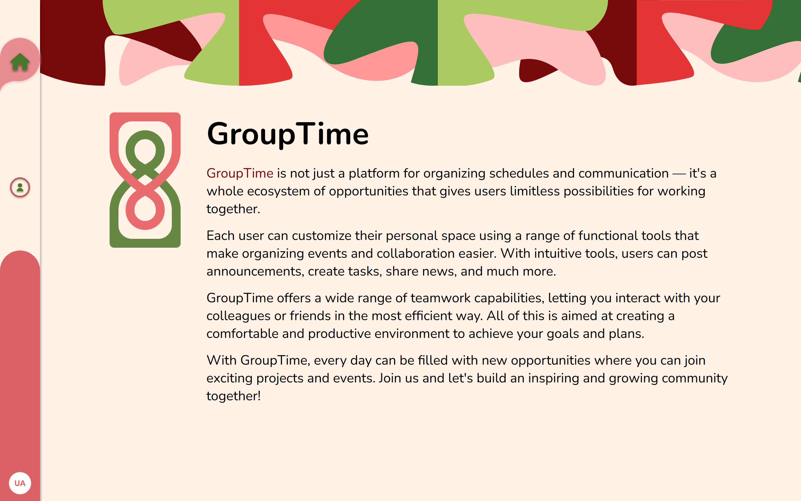
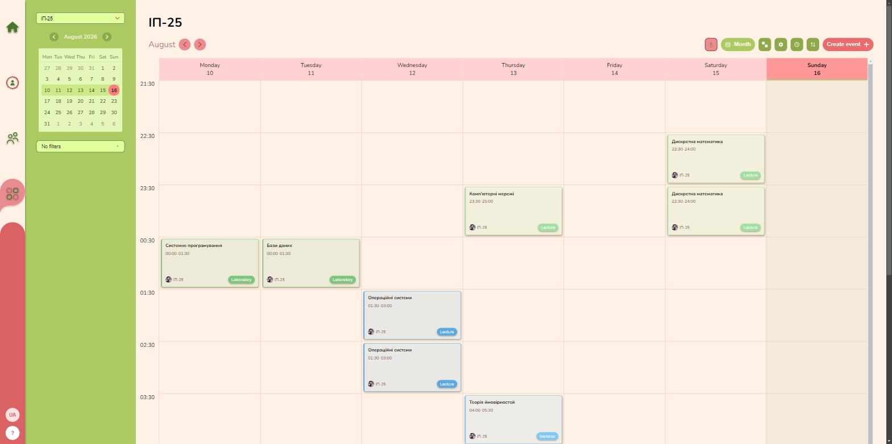
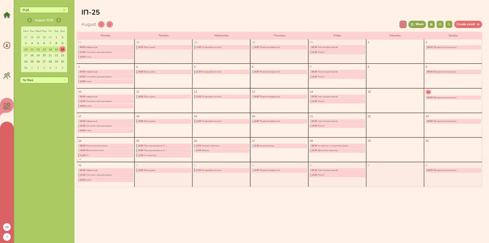
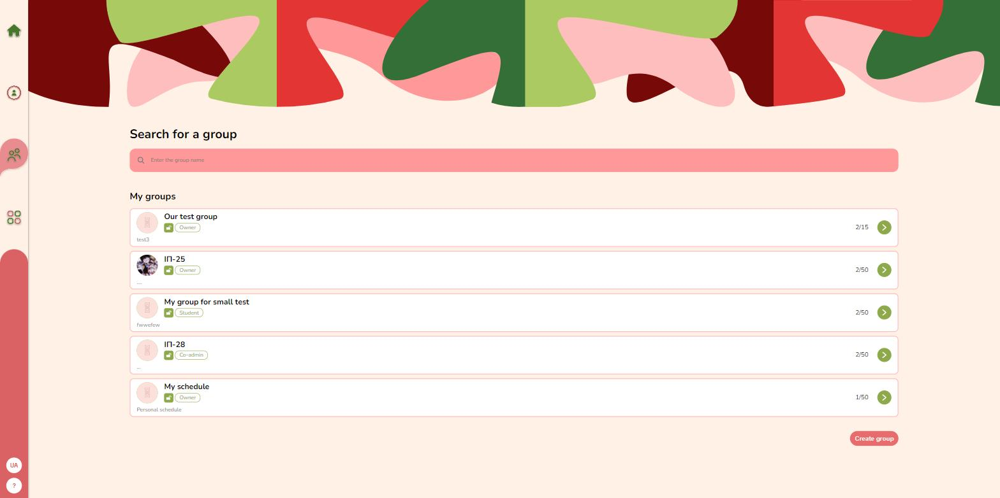
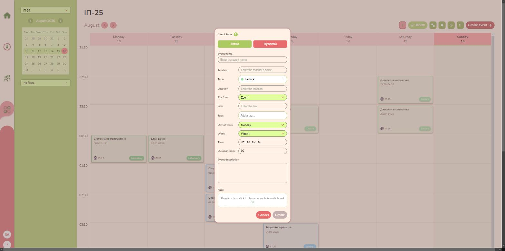
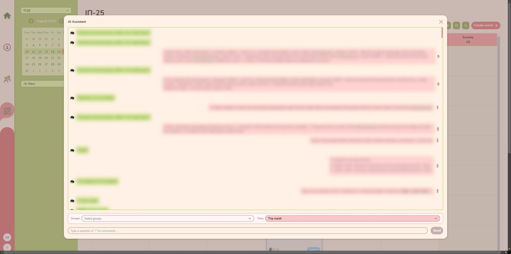
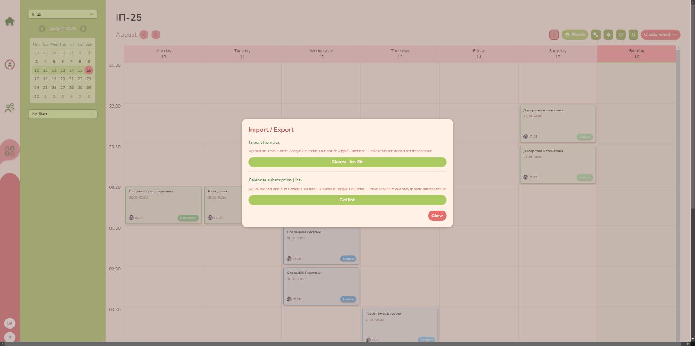
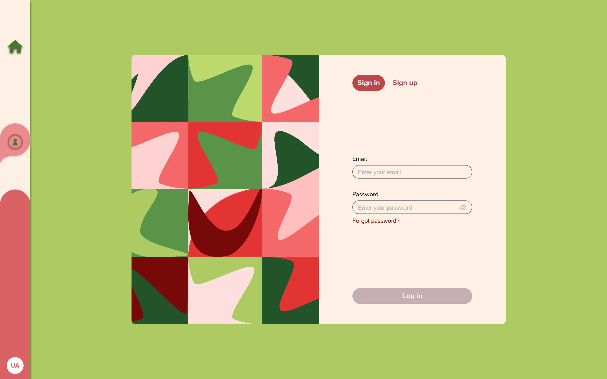

<div align="center">

# GroupTime

**Спільні тижневі розклади для груп — з ролями, нагадуваннями, синхронізацією календарів і AI-асистентом.**

[English](README.md) · **Українська**


**[Живе демо](https://group-time-indol.vercel.app)** · **[Документація API](https://grouptime.onrender.com/api/docs/)**

<sub>API живе на безкоштовному інстансі Render, який засинає після ~15 хв простою — перший запит може будитися до хвилини.</sub>

</div>

---

## Що це

GroupTime — застосунок для планування для **груп людей зі спільним розкладом**: університетського курсу, команди, гуртка. Одна людина складає тиждень, решта його бачить, а застосунок бере на себе те, що зазвичай живе в чаті: хто має право редагувати, коли всі вільні, що змінилося і як затягнути це в календар, яким люди справді користуються.

Розклад належить групі, а кожен учасник має **роль** — Власник, Адміністратор, Спів-адмін, Учасник, Студент — яка визначає, чи може він переглядати розклад, створювати події й змінювати налаштування групи. Поряд із груповими розкладами кожен користувач має **особистий розклад**: приховану групу, що не рахується в ліміті груп і поводиться як звичайна тижнева сітка.

Два типи подій покривають обидві половини реального життя: **статичні** повторюються всередині циклу тижнів (розклад пар, що чергується через 2–3 тижні), а **динамічні** прив'язані до конкретної дати. Поверх цього — щотижневі повторення, нагадування на пошту й у Telegram, імпорт/експорт `.ics`, публічне посилання «лише читання» та AI-асистент, який відповідає на питання про тиждень і створює події зі звичайного тексту.



---

## Можливості

### Тижнева сітка

Головний екран. Дні згори, години збоку, події в клітинках. Події **переносяться перетягуванням** — киньте подію на інший день чи годину, і вона переїде туди. Клітинки з кількома подіями складають їх у кольорові смуги, тож завантажений ранок лишається читабельним. Видимий діапазон годин і часовий пояс групи — це налаштування групи; кожен глядач бачить сітку зсунутою у свій GMT.



### Місячний вигляд

Ті самі дані, але здалеку — календарний огляд місяця, побудований із закешованого тижневого фіду, тож перемикання Тиждень ⇄ Місяць не коштує зайвих запитів. Зручно, щоб побачити форму місяця перед плануванням усередині нього.



### Групи та ролі

Створіть групу, запросіть людей поштою й дайте кожному роль. Параметри групи керують лімітом учасників і тим, яка роль потрібна, щоб бачити розклад, створювати чи видаляти події й отримувати сповіщення на пошту. На картках груп одразу видно вашу власну роль.



### Події з реальними деталями

Подія має назву, тип (кольоровий, створюється на льоту), теги, викладача, місце або платформу з посиланням, тривалість, опис і файли. Її можна **повторювати щотижня** — щотижня або кожні *N* тижнів, до обраної дати — і додати **нагадування**, що приходять на пошту й у Telegram перед початком.



### Фільтри й вільний час

Збережені пресети фільтрів звужують сітку за типом події, тегом, викладачем, місцем/платформою, видом розкладу чи групою. Пошук **вільного часу** працює навпаки: оберіть кілька груп або окремих учасників — і застосунок покаже вікна, коли всі справді вільні.

### AI-асистент

Питайте про розклад звичайною мовою («що в мене завтра?»), запускайте **`/analyze`**, щоб асистент пошукав проблеми в тижні — накладки, перевантажені дні, вікна — або **`/magic`**, щоб створювати й редагувати події описом («створи Лекцію в понеділок о 10:00»). Хто саме може запускати команди — теж налаштування групи.



> Текст повідомлень на скріншоті розмито — у переписці є справжні імена.

### Синхронізація календарів і поширення

Імпортуйте `.ics`, щоб затягнути наявний розклад, експортуйте розклад групи в `.ics` або візьміть **посилання на підписку** й додайте його в Google Calendar, Outlook чи Apple Calendar — розклад синхронізуватиметься сам. Окреме **публічне посилання** відкриває копію тижня «лише для читання» людям без акаунта — зручно для сторінки курсу — і його можна перегенерувати, щоб відкликати старе.



### А ще

Українська й англійська всюди (типова — українська), особистий зсув GMT, навчальний тур із кнопкою «?», завантаження аватара з обрізанням, підтвердження пошти й відновлення пароля.

---

## Стек

| | |
|---|---|
| **Front-end** | React 18, Vite 6, Redux Toolkit + redux-persist, React Router 6, SCSS-модулі, i18next, `@dnd-kit` (drag-and-drop), react-joyride (тур), react-markdown |
| **Back-end** | Node.js + Express 4, MongoDB + Mongoose, JWT з refresh-токенами, валідація Joi, Agenda + node-cron (нагадування), nodemailer, AWS S3 (файли), Groq SDK (AI), логування pino, Swagger UI |
| **Інструменти** | Vitest, Playwright (e2e), Jest + supertest + mongodb-memory-server (API), ESLint, husky + lint-staged, Docker / docker-compose |

```
GroupTime/
├── Front-end/          React SPA (Vite)
│   ├── src/pages/      компоненти маршрутів
│   ├── src/components/ компоненти фіч за доменами (Schedule, Group, Profile…)
│   ├── src/UI/         перевикористовувані презентаційні компоненти
│   ├── src/api/        обгортки fetch за доменами
│   ├── src/redux/      слайси + thunk-и
│   └── src/i18n/       локалі uk / en
├── Back-end/           Express API
│   ├── router/         маршрути
│   ├── controller/     оркестрація запитів
│   ├── middleware/     валідація, права, завантаження ресурсів
│   ├── service/        бізнес- і дата-логіка
│   └── model/          схеми Mongoose
└── docker-compose.yml  Mongo + API + фронт
```

---

## Запуск проєкту

### Варіант 1 — Docker (найшвидше)

Потрібні Docker і файл `Back-end/.env` (змінні — у таблиці нижче).

```bash
docker compose up --build
```

| | |
|---|---|
| Фронт | http://localhost:3000 |
| API | http://localhost:5000/api |
| Документація API (Swagger) | http://localhost:5000/api/docs |
| MongoDB | `mongodb://localhost:27017/grouptime` (том `mongo-data`) |

`MONGODB_URL`, `PORT` і `FROENT_URL` compose підставляє сам; решта береться з `Back-end/.env`.

### Варіант 2 — Локально

**Потрібно:** Node.js 20+ (`node-ical` вимагає regex-флаг `v`) і MongoDB — локальна або безкоштовний кластер [MongoDB Atlas](https://www.mongodb.com/cloud/atlas).

```bash
git clone https://github.com/MainMi/GroupTime.git
cd GroupTime

# API
cd Back-end && npm ci
#   створіть Back-end/.env — змінні нижче
npm run dev                 # http://localhost:5000

# Фронт (другий термінал)
cd Front-end && npm ci
cp .env.example .env        # VITE_API_URL=http://localhost:5000/api
npm run dev                 # http://localhost:3000
```

`Back-end/.env`:

| Змінна | Обов'язкова | Що це |
|---|---|---|
| `MONGODB_URL` | так | Рядок підключення до MongoDB |
| `PORT` | ні | Порт API (типово `5000`) |
| `FROENT_URL` | так | URL фронта — з нього будуються посилання в листах |
| `SELF_URL` | для `.ics` | Публічний URL самого API для абсолютних посилань на підписку |
| `JWT_SECRET`, `JWT_SECRET_REFRESH` | так | Довгі випадкові рядки |
| `ACTION_SECRET_FORGOT_PASSWORD`, `ACTION_SECRET_CONFIRM_EMAIL`, `ACTION_SECRET_CONFIRM_ADD_GROUP`, `ACTION_SECRET_INVITE_USER` | так | Довгі випадкові рядки, по одному на поштову дію |
| `NO_REPLY_EMAIL`, `NO_REPLY_EMAIL_PASS` | для пошти | Скринька, з якої йдуть підтвердження й запрошення |
| `S3_REGION`, `S3_BUCKET_NAME`, `AWS_ACCESS_KEY`, `AWS_SECRET_KEY` | для файлів | Аватари й вкладення подій |
| `GROQ_API_KEY`, `DEFAULT_MODEL` | для AI | AI-асистент |
| `GOOGLE_CLIENT_ID` | для входу Google | Клієнт Google OAuth |

`Front-end/.env` має одну змінну — і суфікс `/api` обов'язковий:

```
VITE_API_URL=http://localhost:5000/api
```

> Vite вшиває змінні `VITE_*` **під час збірки**, тож після зміни цього значення потрібна перезбірка, а не просто рестарт.

### Тести й лінт

```bash
# Back-end — Jest + supertest на MongoDB в пам'яті
cd Back-end && npm test

# Front-end — юніт-тести Vitest, наскрізні тести Playwright
cd Front-end && npm test
cd Front-end && npm run e2e

# Лінт обох воркспейсів із кореня репозиторію
npm run lint
```

---

## Як цим користуватися

Проходження застосунку з порожнього акаунта.

### 1. Створіть акаунт

Зареєструйтеся на `/sign` (або увійдіть через Google) і **підтвердьте пошту** за посиланням із листа — без цього більшість можливостей лишається закритою. Забули пароль? На тій самій сторінці є відновлення.



### 2. Створіть групу

**Групи → створити**: назва, аватар і параметри групи — ліміт учасників і те, яка роль потрібна, щоб бачити розклад, створювати/видаляти події й отримувати сповіщення поштою. Ви стаєте Власником.

### 3. Запросіть людей і роздайте ролі

Запрошуйте учасників поштою зі сторінки групи. Кожне запрошення підтверджують і запрошений, і адміністратор групи. Потім змінюйте ролі — Адміністратор, Спів-адмін, Учасник, Студент — щоб розширити чи звузити права.

### 4. Налаштуйте розклад

Відкрийте **Розклад**, оберіть групу в селекторі й зайдіть у налаштування (шестерня, лише для адміністраторів):

- **Діапазон відображення** — години, які показує сітка.
- **Часовий пояс групи** — час подій зберігається як «настінний» час групи; кожен глядач бачить його зсунутим у свій GMT.
- **Статичні тижні** — якщо розклад чергується через кілька тижнів, створіть їх тут і впорядкуйте.

### 5. Додайте події

Натисніть **Створити подію** й оберіть тип:

- **Статична** — повторюється всередині циклу статичних тижнів (щотижнева пара).
- **Динамічна** — відбувається один раз, у конкретну дату.

Заповніть назву, тип (оберіть колір або створіть новий тип на місці), теги, викладача, місце чи платформу з посиланням, час і тривалість, опис і файли. Для регулярного — увімкніть **Повторювати щотижня**, оберіть щотижня або кожні *N* тижнів і вкажіть кінцеву дату. Додайте **нагадування**, щоб отримати сповіщення поштою або в Telegram перед початком.

### 6. Працюйте з тижнем

- **Перетягніть подію** на інший день чи годину, щоб перенести її.
- Клік по події — редагування або видалення; клік по щільній клітинці — усе, що в ній є.
- Перемикайте **Тиждень ⇄ Місяць** кнопкою вигляду.
- **Панель фільтрів** звужує сітку за типом, тегом, викладачем, місцем чи групою; комбінацію можна зберегти як іменований пресет.
- Оберіть **Усі групи** в селекторі, щоб накласти всі доступні розклади одразу.

### 7. Знайдіть спільний час

Відкрийте **Вільний час**, оберіть групи або окремих учасників — і застосунок покаже вікна, коли ні в кого нічого не заплановано, з можливістю показати або сховати зайняті блоки.

### 8. Користуйтеся особистим розкладом

Оберіть **Мій розклад** у селекторі груп. Він створюється на вимогу за першим разом, лишається приватним і не рахується у вашому ліміті груп — місце для всього, що не стосується групи.

### 9. Заводьте й вивантажуйте календарі

У модалці **Імпорт / Експорт**:

- **Імпорт** файлу `.ics` — повторний імпорт того самого файлу не задублює події.
- **Експорт** розкладу групи в `.ics`.
- **Посилання на підписку** з налаштувань розкладу — додайте його в Google Calendar, Outlook чи Apple Calendar для автоматичної синхронізації.
- **Публічне посилання** дає перегляд тижня «лише читання» людям без акаунта. Перегенеруйте його, щоб відкликати доступ.

### 10. Спитайте асистента

Відкрийте асистента, оберіть групи й період, який він має врахувати, і далі:

- Питайте звичайною мовою — *«що в мене завтра?»*
- **`/analyze`** — нехай перевірить тиждень і покаже знайдені проблеми.
- **`/magic`** — *«створи Лекцію в понеділок о 10:00»* — і підтвердьте запропоновану зміну.

### 11. Особисті налаштування

У **Профілі**: аватар (завантаження й обрізання), ваш зсув GMT і Telegram для нагадувань. Перемикач мови — унизу лівої навігації, а кнопка **?** повторює тур для поточної сторінки.

---

## Деплой

Проєкт живе на безкоштовних тарифах: **MongoDB Atlas** (база) + **Render** (API, Docker) + **Vercel** (фронт). API має власний `Dockerfile` (root directory — `Back-end`), фронт збирається через Vite у `build/`. Обидва деплояться з `main`.

---

## Ліцензія

Приватний проєкт. Усі права застережено.
